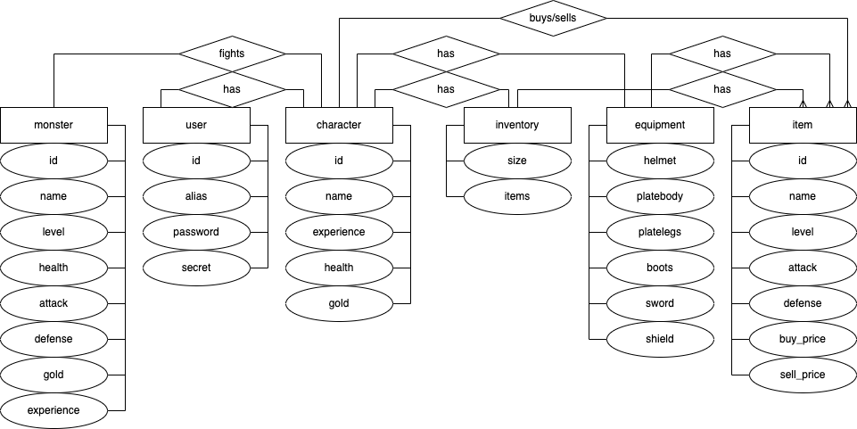
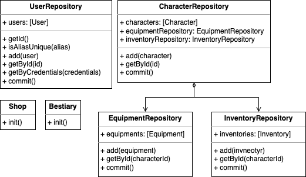

# simple-rpg-server
Server for Simple RPG

## Краткое описание идеи проекта
Простая ролевая игра со следующими возможностями:
- сражение с монстрами;
- управление экипировкой.

## Краткое описание предметной области

Соревновательные игры с уклоном в менеджмент. 
Пользователи развивают персонажа, повыщая его характеристики, для последующего соперничества с другими игроками. 
В данной сфере важны тщательно продуманный баланс, пресечение нечестной игры и отсутствие сбоев.

## Краткий анализ аналогичных решений

|   |Simplest RPG|Melvor Idle|Simple RPG|
| --- | --- | --- | --- |
| Бесплатно | + | - | + |
| Отсутствие микротранзакций | - | + | + |
| Серверная валидация | - | - | + |

## Краткое обоснование целесообразности и актуальности проета

Компании активно переходят в онлайн и им требуются разработчики, занимающиеся серверной частью приложений.

## Диаграмма сценариев использования

## Диаграмма сущностей

## Тип приложения 

Mobile

## Технологический стек

С++, Boost.Beast, Boost.Asio, PQXX, PostgreSQL, Swift.

## Компоненты

- графический интерфейс;
- трансфер данных;
- прикладной;
- доменный;
- доступ к данным.

## Диаграмма классов предметной области

## Диаграмма классов уровня приложения

## Диаграмма классов PostgreSQL адаптера

## Диаграмма классов HTTP адаптера

## Диаграмма классов пользовательского интерфейса

